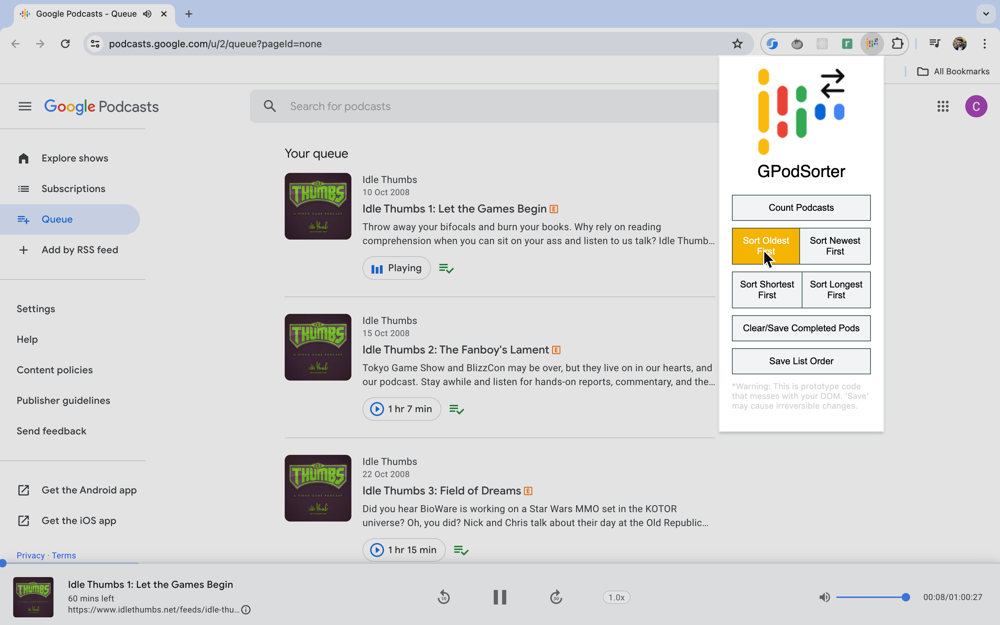

# GPodSorter

A prototype Chrome extension to sort your Google Podcasts queue.

Watch the demo on YouTube below.

## Description

Fed up of manually swiping podcasts in the order I wanted, I wrote a little bit of javascript to reorder them. Saving the queue order was a bit messy, having to manually target the button and simulate a click. I found this collection of js useful so I packaged it into an extension.

While it caters to my needs with some patience, this extension will likey become obsolete soon as Google Podcasts will go the way of Play Music and be merged with YouTube.

## Getting Started

### Dependencies

* written for Chrome version: 124.0.6367.119

### Installation and Usage

1. Clone the repository.
2. Go to [Chrome Extensions](chrome://extensions/), click on "Load unpacked," and select the extension directory.
3. Update the package to see local changes.

## Collaboration

Contributions are welcome! Feel free to fork the repository and enhance this project. Your feedback is greatly appreciated.

## License

This project is licensed under the MIT License - see the [LICENSE.md](LICENSE.md) file for details.

## Acknowledgments

Inspiration, code snippets, etc.
* [DomPizzie README Template ](https://gist.github.com/DomPizzie/7a5ff55ffa9081f2de27c315f5018afc)
* [Sansation font ](https://fonts.googleapis.com/css2?family=Sansation:wght@100;400;700&display=swap)